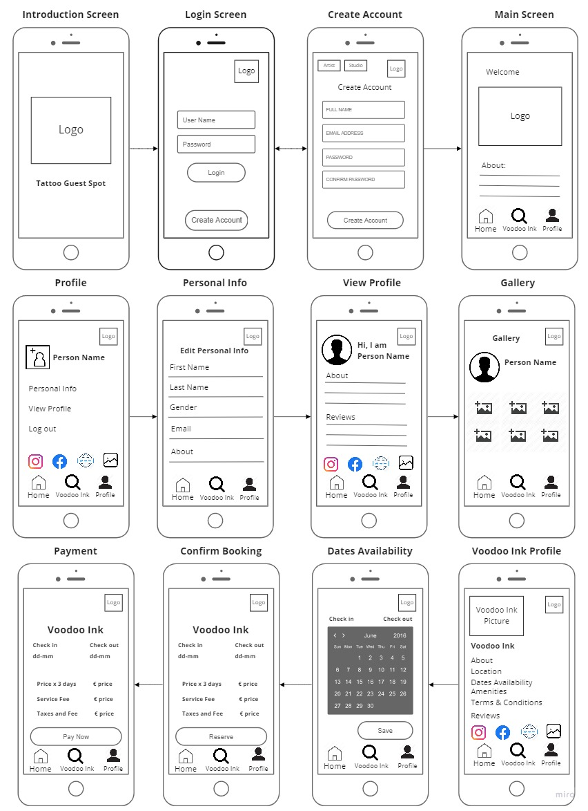
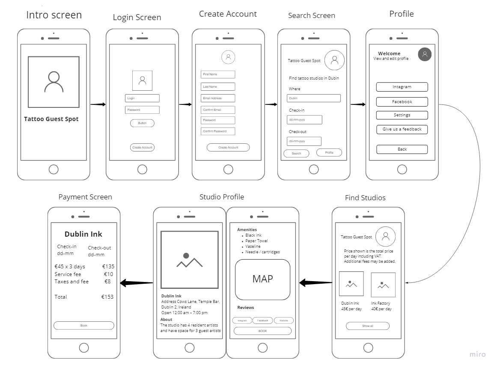

# Booking-system application developed as my final year project 2020
 
The purpose of this project is to develop a mobile application prototype to assist the booking system
for Tattoo Guest Artists at Voodoo Ink Tattoo Studio. The prototype will be built in React-Native and
Firebase Real-time database to store the data. Tattoo Guest Spot App will create a simplified booking
system for renting out stations in Voodoo Ink Tattoo Studio, allowing Guest Artists and Voodoo Ink
Tattoo Studio to use their time more efficiently and effortlessly.
The main goal of this project is to deliver a prototype where the artist will be able to create an account,
login, create a profile and also be able to create, edit and cancel an appointment made at Voodoo Ink
Tattoo Studio.

# Case Study

Voodoo Ink first opened its doors in 2017, with an aim to create fresh, unique and customized tattoo
designsfortheir clients, family and friends. Starting as a small tattoo studio based in Dublin, within two
years, Voodoo Ink grew from a smallstudio space thatinitially fit 2 Artists, to now being one of Dublin's
most exciting Tattoo spots, accommodating 3-5 Tattoo Artists. Voodoo Ink had a great demand for
tattoo artist doing realistic tattoos. Due to the lack tattoo artists working on this particular style
Voodoo ink opened the doors for Guest Tattoo Artists.
Since Voodoo Ink opened the doors for guest artists the studio is receiving many messages from tattoo
artists every week, from different platforms. Voodoo Ink is a small studio therefore all the messages
from tattoo artists are being answered by the studio’s owners. However, they find difficult to keep in
track with the messages as the same artist may send the same message through different platforms,
resulting on confusion, the owners most of the time don’t know whether they have already responded
that person or not, and they are missing few messages and artists is not being answered.
In order to rent a station at Voodoo Ink, a verbal or written contract will be confirmed prior to the
artist's visit. This contract is composed of terms and conditions, and needs to be passed to each artist
every time.
Due the utilization of multiple platforms as (Email, Facebook and Instagram) the studio owners may
send the contract to the artist more than one time or in a worst scenario, they think they responded
an artist already in one platform and they skip the message of a person that didn’t received an answer
yet. This issues of not respond some artists, and replaying other artists more than one time with the
same message, an optimization is clearly needed.
Was suggested to Voodoo Ink an implementation of a booking system where the guest tattoo artist
will be able to book an appointment through a single platform. 

# Wireframe User side

# Wireframe Admin side

